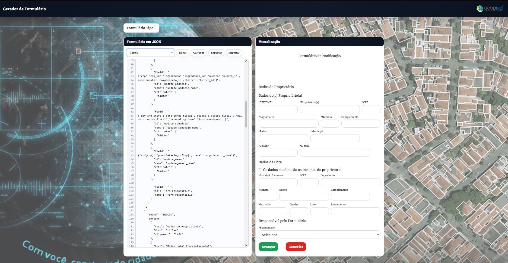

# Formulários

Gerador/visualizador de formulários a partir de um JSON, com templates prontos e pré-visualização no navegador.

## Screenshot



## Funcionalidades

- **Templates**
  - Seleção de modelos no dropdown (ex.: `Formulário Tipo 1`, `Tipo 2`, `Tipo 3`, `Formulário Limpo`).
- **Edição via JSON**
  - Cole/edite um JSON na área “Formulário em JSON”.
  - A pré-visualização é atualizada automaticamente.
- **Validação básica**
  - Mostra erro quando o JSON é inválido.
  - Normaliza `id`/`name` trocando `.` por `_` (e exibe aviso no console).

## Como executar

Recomendado: rodar com Vite para ter servidor local e recarregamento automático.

1. Instale as dependências:

```bash
npm install
```

2. Suba o servidor de desenvolvimento:

```bash
npm run dev
```

O Vite vai exibir no terminal a URL (normalmente `http://localhost:5173`).

Opcional:

```bash
npm run build
npm run preview
```

Observação: o `package-lock.json` é atualizado automaticamente pelo npm após `npm install`.

## Estrutura do projeto

```
.
├─ index.html
├─ assets/
│  ├─ css/
│  │  └─ global.css
│  ├─ img/
│  │  ├─ geologo.png
│  │  └─ geopixel.png
│  └─ js/
│     ├─ forms.js
│     └─ global.js
└─ README.md
```

## Onde ficam os templates

Os templates ficam em `assets/js/forms.js`, expostos como `window.FORM_TEMPLATES`.

## Formato do JSON (visão geral)

O JSON esperado segue (em alto nível) a ideia abaixo:

```json
{
  "divisions": [
    {
      "theme": "INICIO",
      "content": [
        { "text": "Título", "alignment": "center" },
        { "field": "Nome", "id": "nome", "type": "text", "width": 50 },
        { "checkbox": "Aceito os termos", "id": "aceite" },
        { "selectlist": "Opções", "id": "opcao", "options": "A;B;C" }
      ]
    }
  ]
}
```

Itens aceitos dentro de `content` (conforme o renderizador em `assets/js/global.js`):

- **`text`**: bloco de texto.
- **`field`**: input (suporta `type: "text"` e `type: "numeric"`).
- **`checkbox`**: checkbox.
- **`selectlist`**: select (com `options` separado por `;`).
- **`button`**: botão (há um tema especial `BUTTONS_GROUP_ID` para agrupar botões).

Observação: prefira `id`/`name` sem `.` (use `_`).